# 再也不用手动剪辑了!推荐14款AI自动化视频再创作的神器

长视频素材堆积如山却无暇剪辑、手动寻找精彩片段耗时数小时、多平台发布需要反复调整尺寸和格式,这些痛点让无数内容创作者和营销人员身心俱疲。传统视频剪辑不仅需要专业技能和昂贵软件,还要花费大量时间逐帧筛选精华内容,效率低下且难以规模化。AI视频再创作工具通过智能分析、自动剪辑、精准识别高光时刻,可在几分钟内将一个小时长视频自动转化为数十条适配TikTok、Instagram Reels、YouTube Shorts的短片,并自动添加字幕、配音和特效。本文精选14款经过市场验证的AI视频再利用平台,从播客剪辑到社交媒体内容批量生产,从自动字幕到多语言配音,覆盖内容再创作全流程需求,助您找到操作简便、识别准确、输出高效的智能剪辑方案。

## **[Munch](https://www.getmunch.com)**

AI驱动的视频再创作领导者

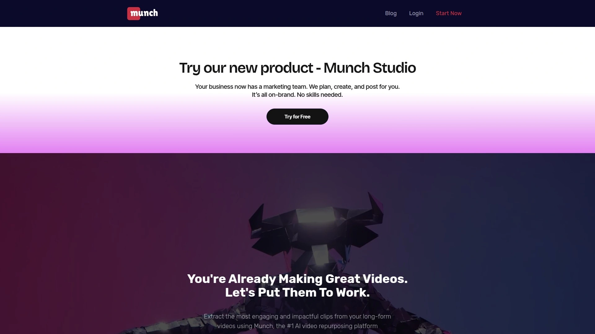

Munch是专为内容营销和社交媒体优化设计的AI视频再利用平台,通过先进的机器学习算法自动识别长视频中最具吸引力的片段。平台特别擅长分析视频内容并预测哪些片段最有可能在社交媒体上获得高互动率。

**智能分割技术**能够快速分析长达数小时的视频内容,自动标记高潮时刻、情感峰值和关键信息点,精准提取最具病毒传播潜力的片段。系统不仅关注内容本身,还综合考虑平台算法偏好、用户参与度趋势和SEO优化因素。AI自动生成适配不同社交平台的字幕、标题和描述文案,节省手动编写时间。

平台支持将单个长视频转化为多种格式和长度的短片,每个片段自动调整为9:16竖屏、16:9横屏或1:1方形比例,完美适配TikTok、Instagram Reels、YouTube Shorts、LinkedIn等各大平台。自动裁剪功能智能识别视频中的人物和重要元素,确保竖屏转换时不会遗漏关键画面。

Munch的核心优势在于其投资回报率计算能力,系统可评估每个生成片段的预期表现并提供优化建议。创作者无需从头开始制作新内容,只需上传现有的网络研讨会、播客、教程或访谈视频,平台即可自动生成几十条高质量短片。这种再创作策略大幅延长原始内容的生命周期,最大化每一次拍摄投入的价值。

定价灵活,提供免费试用让用户体验AI剪辑能力,付费计划根据视频处理量和输出数量分层。特别适合需要持续产出社交媒体内容的营销团队、YouTube创作者和品牌机构。

## **[OpusClip](https://www.opus.pro)**

AI自动剪辑的病毒短片制造机

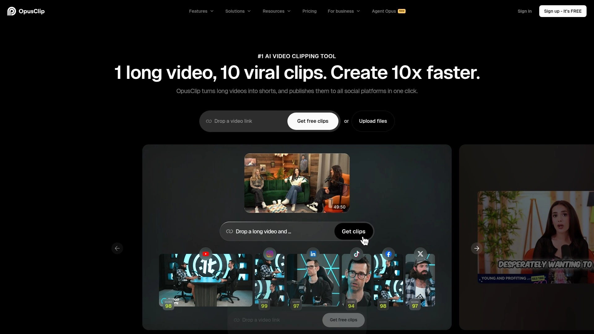

OpusClip使用GPT-3.5 Turbo等先进AI模型,从单个长视频自动生成10+条高质量短片,每条都经过智能优化以提升病毒传播潜力。平台服务超过1000万创作者,在内容创作行业迅速获得认可。

**一键生成流程**极为简单,用户只需粘贴视频链接或上传文件,AI自动分析内容、识别精彩时刻、执行跳切重排、添加动态字幕和表情符号。系统还能自动重构画面以适应竖屏格式,确保主体始终在画面中心。

病毒潜力评分功能是OpusClip的独特卖点,每个生成的短片都会获得一个基于AI预测的病毒传播可能性评分,帮助创作者优先发布最有潜力的内容。支持多语言字幕生成和语音检测,适合国际化内容团队。

合作伙伴计划提供25%循环收益持续12个月,每月15日自动通过PayPal支付,60天有效推荐期给予充足转化时间。适合播客主、教育工作者、商业教练和社交媒体经理等需要快速将长内容转化为可分享片段的用户。

## **[Vizard.ai](https://vizard.ai)**

60天追踪窗口的AI剪辑专家

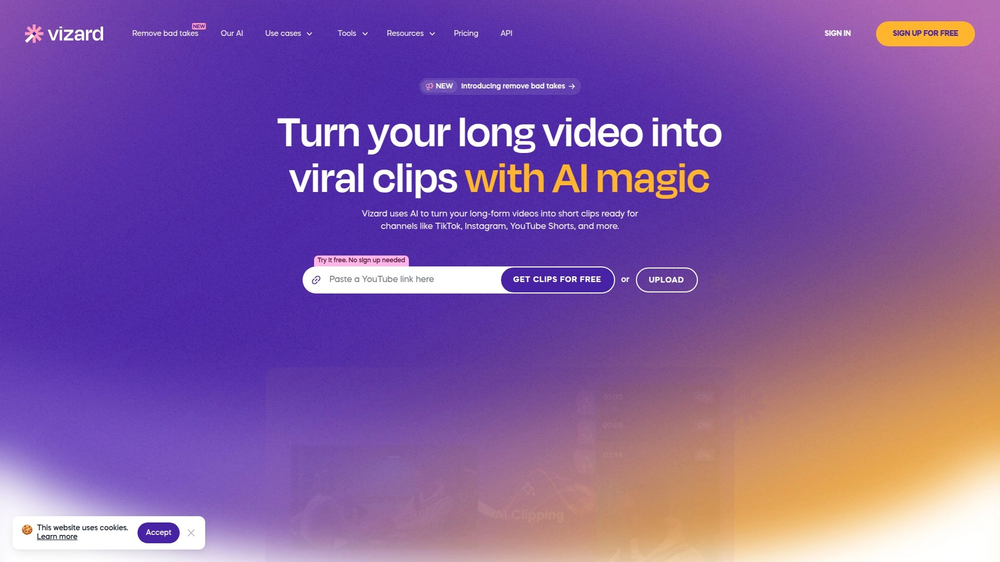

Vizard.ai通过AI自动将长视频转化为30+条短片,系统智能识别引人入胜的时刻并一键剪辑。特别擅长处理网络研讨会、播客、访谈等对话类内容。

**文本编辑视频**是Vizard的创新功能,平台自动转录视频为文字,用户直接编辑文本即可完成视频剪辑,删除句子会自动移除对应画面。这种方式让非专业剪辑师也能轻松处理复杂视频项目。

演讲者追踪技术确保多人对话视频中画面始终聚焦发言者,自动裁剪和调整让竖屏输出更加专业。自动生成字幕、话题标签和社交媒体文案,简化发布流程。团队工作空间功能支持实时协作,适合代理机构和内容团队。

合作伙伴计划提供25%收益,Cookie有效期长达60天在行业中处于领先水平。定价分为免费版(120上传分钟/月)、创作者版($20/月)和团队版($30/座位/月),支持从个人到企业的不同规模需求。

## **[Submagic](https://www.submagic.co)**

30%终身收益的短视频AI编辑器

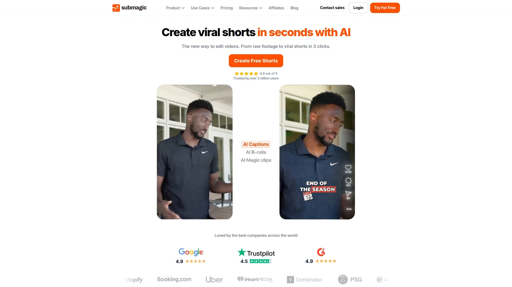

Submagic被誉为短视频AI编辑器的第一名,专注于为TikTok、Instagram Reels、YouTube Shorts等平台快速创建引人注目的内容。平台强调自动化和易用性,让创作者无需剪辑经验即可产出专业效果。

**自动字幕生成**是Submagic的核心功能,AI准确识别语音并生成时间同步字幕,支持多种动态样式和颜色主题,显著提升视频可访问性和观看完成率。系统还自动添加表情符号、高光效果和视觉特效,让视频更具吸引力。

AI生成视频开场钩子功能帮助创作者在前3秒抓住观众注意力,提升视频留存率。平台界面直观,从上传到导出通常只需几分钟。

合作伙伴计划提供30%终身循环收益,只要推荐用户持续订阅就能持续赚取,无收益上限。特别适合YouTube创作者、社交媒体影响者、内容作家和教练推荐给自己的受众。两分钟即可开始赚取被动收入。

## **[Klap](https://klap.app)**

30%终身循环收益的病毒短片生成器

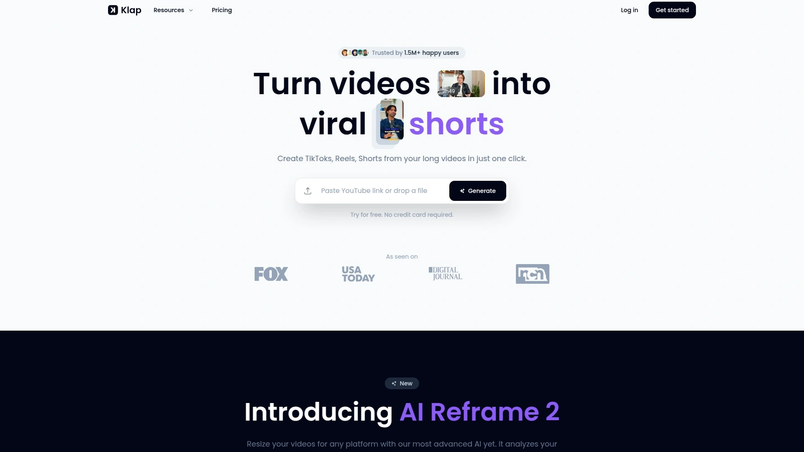

Klap将长视频自动转化为病毒传播潜力高的竖屏短片,AI智能识别最具吸引力的话题并自动生成引人注目的字幕。平台承诺用几次点击就能从内容中创建引人入胜的视频片段。

**合作伙伴计划极具吸引力**,提供30%终身循环收益,例如30位用户通过推荐链接订阅Pro计划(每月$79),推广者每月可获得$630持续收入。最低提现门槛仅$20,通过PayPal快速到账。

系统自动为每个短片生成吸引眼球的字幕和标题,优化社交媒体表现。支持多种视频风格和主题定制,适应不同品牌调性。仪表板实时追踪访问量和销售数据,透明掌握推广效果。

定价从基础计划到Pro版本分层清晰,适合个人创作者和专业团队。用户可通过Discord或在线聊天获得技术支持。特别适合需要快速批量生产社交媒体内容的营销人员和影响者。

## **[SendShort](https://sendshort.ai)**

30%终身收益的病毒短片即时创作工具

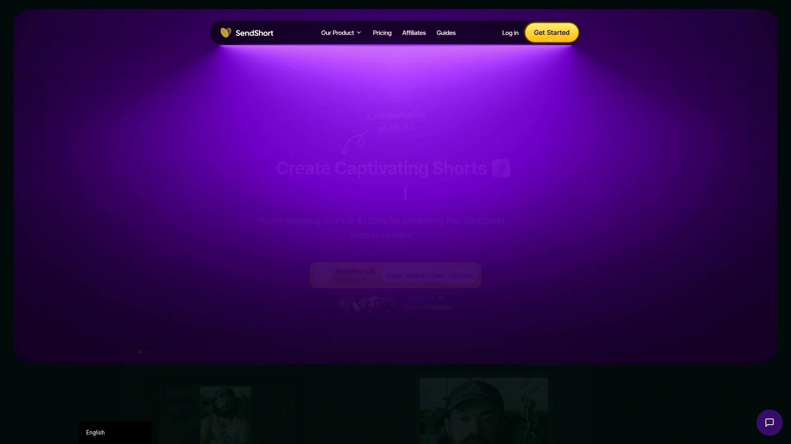

SendShort自动从长内容生成引人注目的短视频,最大化影响力同时最小化工作量。平台声称帮助创作者将互动率提升36%,每天节省12小时工作时间。

**AI配音功能**提供10+种声音选项用于自动生成旁白,这是Submagic等竞品不具备的优势。AI无脸视频生成器能创建完整视频并自动编辑、配音和翻译,适合不想出镜的创作者。长视频剪辑功能包含在所有计划中无需额外付费,而某些竞品要额外收费$20/月。

定价从$15/月起步,比同类工具更具性价比且功能更全面。合作伙伴计划提供30%终身收益,创作者只需制作视频推广应用即可开始赚取被动收入。

平台提供完整的AI编辑套件,从剪辑到无脸视频生成再到自动化处理,一站式解决内容创作需求。24×7客户服务和支持确保用户获得及时帮助。

## **[AI Video Cut](https://www.aivideocut.com)**

30%收益和180天追踪的智能剪辑工具

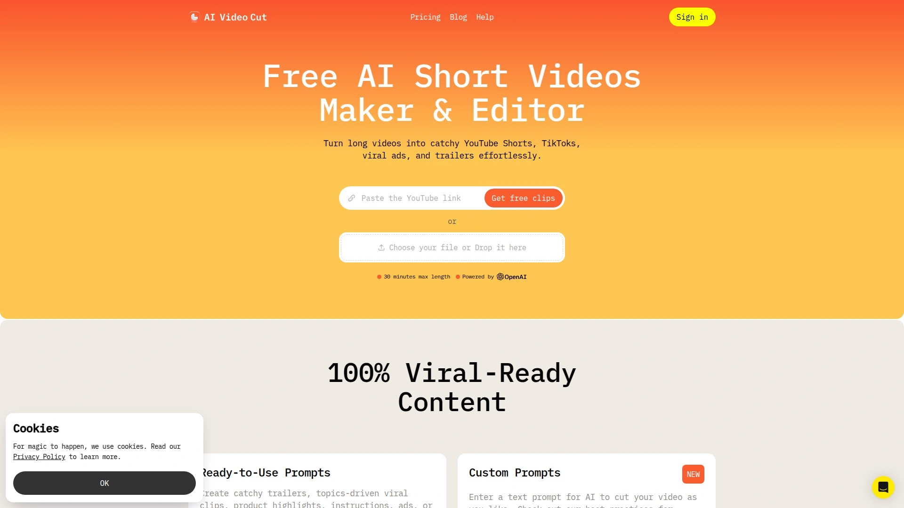

AI Video Cut将长视频秒速转化为短小精悍的病毒片段,特别受影响者、社交媒体经理和创业者喜爱。平台承诺高病毒传播率和高收益潜力。

**合作伙伴计划优势明显**,提供30%首月收益加后续20%持续收益,180天Cookie追踪期在行业中极为罕见,大幅提升转化归属准确性。最低支付门槛$50,仅通过PayPal发放。

AI自动发现长视频中最引人入胜的时刻并剪辑为即刻可发布的短片,适配TikTok、Instagram、YouTube Shorts等平台。简单的入门流程和强大的结果让访客快速转化为付费订阅用户。

实时追踪点击、销售和支付数据,推广者可随时监控业绩表现。无复杂设置,24-48小时内即可通过申请开始推广。庞大且忠实的客户基础证明产品价值和用户满意度。

## **[Clipwise](https://www.clipwise.ai)**

30%循环收益的AI短视频生成器

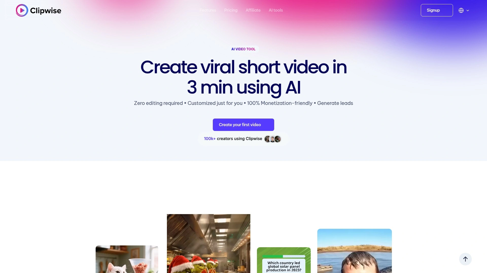

Clipwise使用AI技术在3分钟内将文本提示转化为病毒短视频,零编辑经验要求。平台提供AI主播、互动测验、Reddit风格等多种视频格式选择。

**语音克隆功能**让用户可使用自己声音的克隆版本为视频配音,增加个性化触感。AI脚本编写工具根据主题自动生成视频脚本,简化创作流程。所有视频100%适合平台变现政策,无版权风险。

合作伙伴计划提供30%循环收益,例如一个推荐用户每年可带来高达$3,412收益。最低支付门槛和透明的追踪系统确保推广者利益。

定价从$25/月起,虽然相比某些竞品略高,但提供的视频风格多样性和定制化能力是其独特优势。特别适合希望创建高度个性化和品牌化短视频内容的营销人员。

## **[Flixier](https://flixier.com)**

20%循环收益的云端视频编辑平台

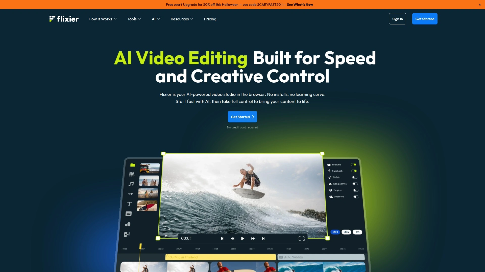

Flixier是基于云的视频编辑强力工具,强调速度和协作,完全在浏览器中运行无需下载。闪电般的渲染速度和实时协作功能使其成为团队、代理和远程编辑的理想选择。

**AI功能丰富**,包括自动字幕生成、音频增强、视频生成能力,以及文本转视频等先进工具。5000+专业模板覆盖YouTube、TikTok、播客精华片段和品牌内容等各种场景。

云渲染技术让视频处理速度远超传统桌面软件,实时项目协作功能允许团队成员同时编辑同一项目。AI驱动的字幕、转录和拖拽式编辑器让工具在拥挤市场中脱颖而出。

通过ShareASale网络运营合作伙伴计划,提供20%循环收益和30天Cookie窗口。平台提供丰富的创意素材和专门的团队支持,帮助推广者成功。适合服务创作者、营销人员和视频编辑受众的内容创作者推荐。

## **[Descript](https://www.descript.com)**

$25/用户的播客和视频编辑革命

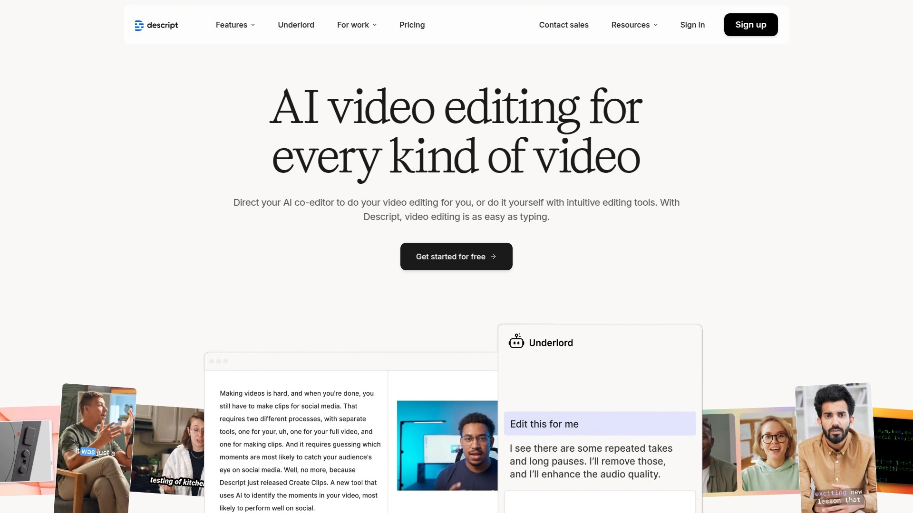

Descript将文本编辑的简单性带入视频和音频制作,通过编辑文字稿即可剪辑视频,彻底简化后期流程。特别受播客主、YouTube创作者和视频编辑青睐。

**Overdub AI语音克隆**技术让用户可用自己声音修正视频中的口误,无需重新录制。Studio Sound自动移除填充词(嗯、啊等)和长时间停顿,让内容更流畅专业。

屏幕录制、多轨编辑、绿幕移除、Audiogram生成器等功能集成在统一界面,一站式完成创作。支持团队协作和项目共享,适合内容制作工作室。

合作伙伴计划为每位新订阅用户提供$25收益,全球内容创作者均可申请。通过PartnerStack平台追踪业绩并每月通过PayPal自动支付。免费计划包含基础功能,付费版解锁更多AI能力和导出时长。

## **[VEED.io](https://www.veed.io)**

浏览器端的快速视频编辑方案

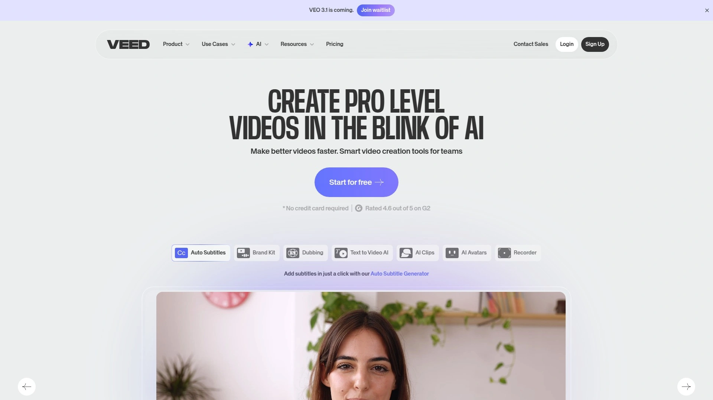

VEED.io是基于浏览器的视频编辑平台,无需下载软件即可完成专业剪辑。特别适合需要快速制作和分享视频的远程团队。

**自动字幕生成**支持多种语言,准确率高且可自定义样式。AI数字人和语音翻译功能让用户能够创建多语言视频内容。屏幕录制、视频压缩、格式转换等实用工具集成,满足日常处理需求。

协作功能允许团队成员实时工作,评论和审批流程高效顺畅。模板库涵盖社交媒体帖子、广告、演示文稿等多种场景。

合作伙伴计划对创作者和营销人员开放,审批后即可开始推荐获得收益。定价从免费基础版到商业计划分层清晰,满足不同规模团队需求。

## **[Kapwing](https://www.kapwing.com)**

循环收益的协作视频工作室

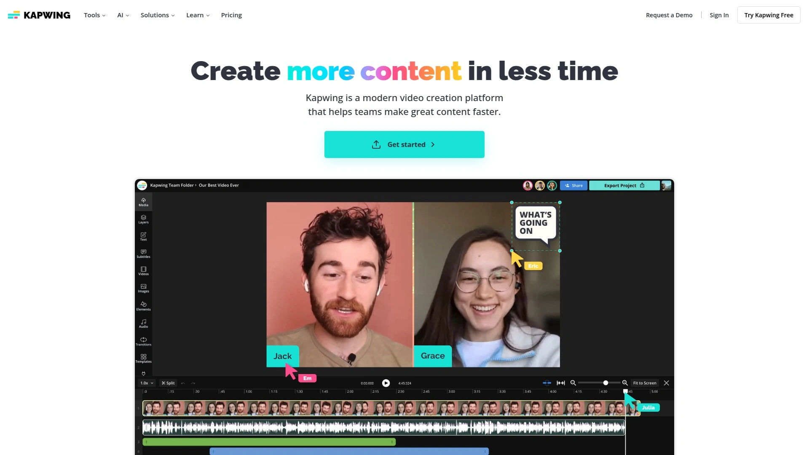

Kapwing提供基于云端的视频编辑平台,强调团队协作和快速迭代。适合营销团队、内容工作室和社交媒体经理使用。

**循环收益结构**让推广者从推荐客户的持续订阅中获得收益。智能剪辑工具自动识别视频中的精彩片段,适合从长视频提取短片用于社交媒体。

字幕编辑器支持多种语言和样式定制,提升视频可访问性和参与度。实时协作功能让团队成员同时编辑同一项目,评论和反馈直接在时间轴上标注。

免费加入且收益取决于推广效果,为高流量创作者提供可观回报。模板和预设简化重复性任务,提高工作流程效率。

## **[Repurpose.io](https://repurpose.io)**

10%收益的跨平台内容自动分发

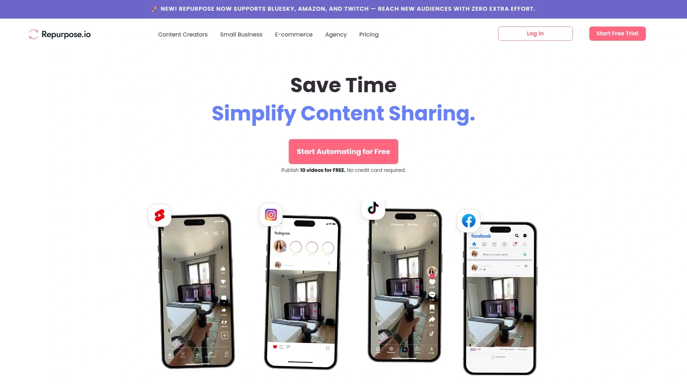

Repurpose.io专注于自动化社交媒体内容分发,连接不同社交账号并设置自动化工作流将内容从一个平台发布到其他平台。特别适合需要在多个平台保持活跃的创作者。

**自动化工作流**是核心功能,用户设置规则后系统自动将YouTube视频转发为TikTok、Instagram Reels、Facebook等平台的内容,无需手动上传下载。为各社交媒体平台定制内容格式,确保每个平台获得最优展示效果。

合作伙伴计划提供10%收益,30天Cookie窗口和专属支持。注册免费,分享对Repurpose的喜爱即可开始赚取。

虽然收益比例不如其他工具高,但产品解决的自动化分发需求让其在特定用户群中有独特价值。适合管理多个社交账号的营销人员和内容创作者。

## **[Movavi](https://www.movavi.com)**

30%收益的多媒体工具套件

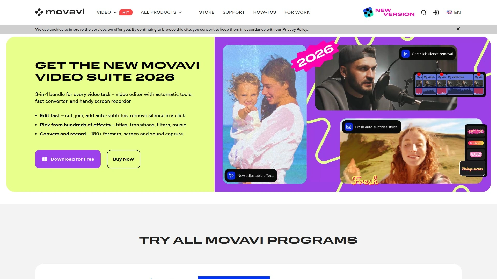

Movavi是用户友好型编辑工具的知名品牌,其视频编辑器、屏幕录制器和一体化视频套件深受初学者和专业人士喜爱。产品线广泛且可靠性经过验证。

**30%收益分成**适用所有产品销售,还可申请个性化收益计划。120天Cookie窗口给予充足的转化时间,远超行业平均水平。

提供营销工具包帮助生成销售,自营的合作伙伴平台(affiliates.movavi.com)管理便捷。适合博主、YouTube创作者和教育工作者向富有创造力或技术娴熟的受众推荐。

广泛的产品阵容和成熟的品牌声誉使其成为任何创作者或营销人员的理想推荐选择。

---

## 常见问题

**AI视频再创作工具如何识别精彩片段?**

现代AI工具如Munch和OpusClip使用多层神经网络分析视频内容,综合考虑语音转录、情感分析、视觉变化和音频峰值等多个维度。系统识别对话中的关键信息点、情绪高潮、笑声或掌声等互动信号,并结合平台算法偏好预测病毒传播潜力。Vizard的文本编辑功能让用户可在自动转录基础上手动微调,平衡AI效率和人工判断。建议首次使用时检查AI选择的片段是否符合品牌调性,多次使用后系统会学习用户偏好并优化推荐。OpusClip的病毒潜力评分功能特别有用,帮助创作者优先发布最有可能成功的片段。

**批量生产短视频会影响内容质量吗?**

AI工具的目标是提升效率而非降低质量,关键在于如何使用。SendShort和Submagic等平台自动添加专业字幕、转场和特效,输出质量往往超过手工剪辑的新手作品。但需注意AI可能无法完全理解内容语境或品牌调性,建议将AI生成视频视为初稿,添加开场介绍、结尾号召或品牌元素提升个性化。Munch的优势在于不仅自动剪辑还优化SEO和社交媒体元数据,确保内容既高效又高质。高产量创作者如播客主可用Descript快速处理每集内容,然后人工审核并添加独特见解。关键是利用AI节省重复性工作时间,将精力投入创意和策略层面。

**如何选择适合自己的AI视频再创作工具?**

选择工具前明确主要需求:需要从零创建短视频选Clipwise或SendShort,将现有长视频转化为多条短片选Munch、OpusClip或Vizard,跨平台自动分发选Repurpose.io。预算考量方面,Klap和Submagic提供30%终身循环收益的慷慨合作计划,适合推广者。功能需求上,需要语音克隆选Clipwise或Descript,需要AI配音选SendShort,需要文本编辑视频选Vizard或Descript。界面易用性方面,Submagic和Klap以简洁友好著称适合新手,Flixier和Descript功能强大适合专业团队。建议利用免费试用或基础计划测试2-3款工具,对比输出质量、剪辑准确度和工作流适配度再做决定。

---

## 总结

AI视频再创作技术正在重新定义内容生产方式,从耗时数小时的手动剪辑转变为几分钟即可批量生成专业短片的智能化流程。本文介绍的14款工具各具特色,从自动识别精彩片段到智能优化社交媒体表现,从单一视频剪辑到跨平台内容分发,覆盖视频再利用的多元化需求和预算范围。**[Munch](https://www.getmunch.com)** 凭借其先进的AI分析技术、病毒潜力预测能力、多平台自动适配、SEO和社交媒体元数据优化、以及投资回报率最大化的设计理念,特别适合追求内容价值最大化、需要规模化社交媒体产出、重视数据驱动决策的营销团队和内容创作者,是平衡智能分析、自动化效率和商业价值的顶级选择。无论您是播客主、YouTube创作者、社交媒体经理还是品牌营销人员,合理运用AI视频再创作工具都能显著降低内容生产成本,缩短发布周期,让每一次拍摄投入产生10倍以上的内容价值回报。
